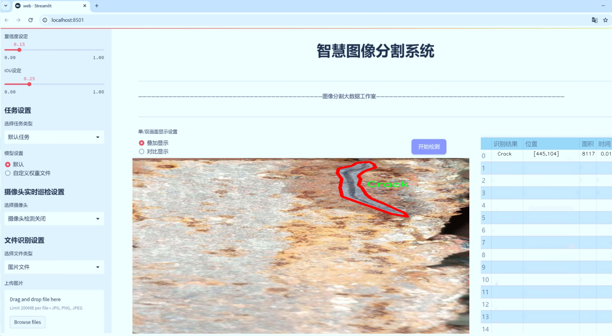
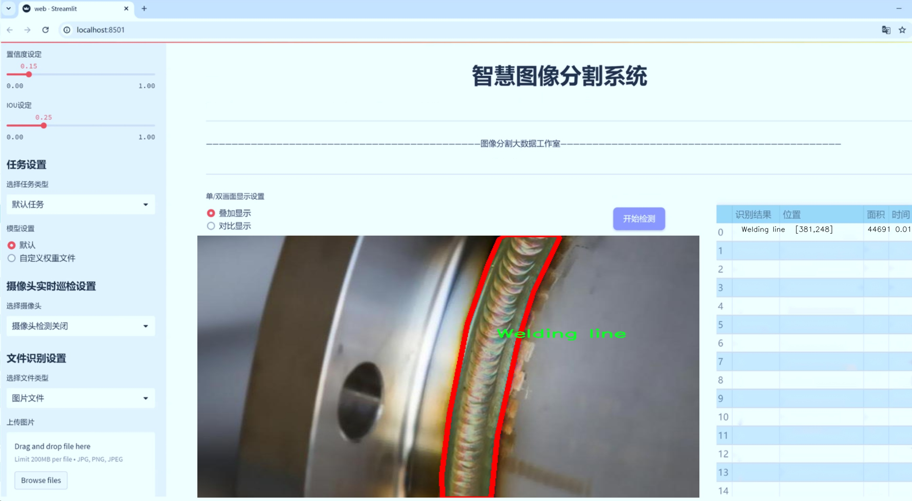
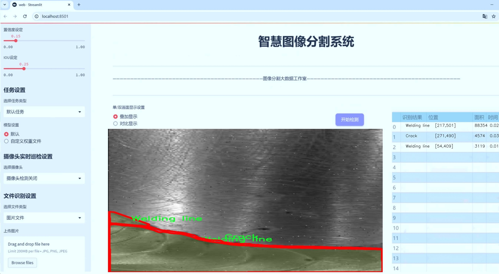
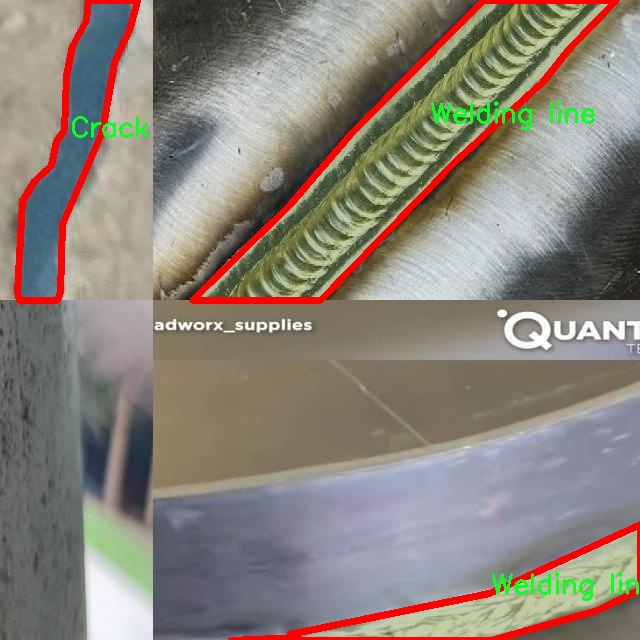
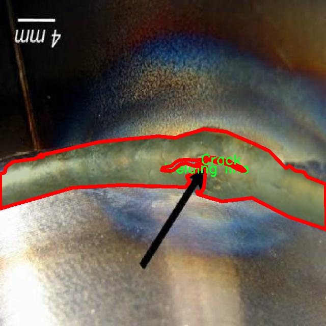
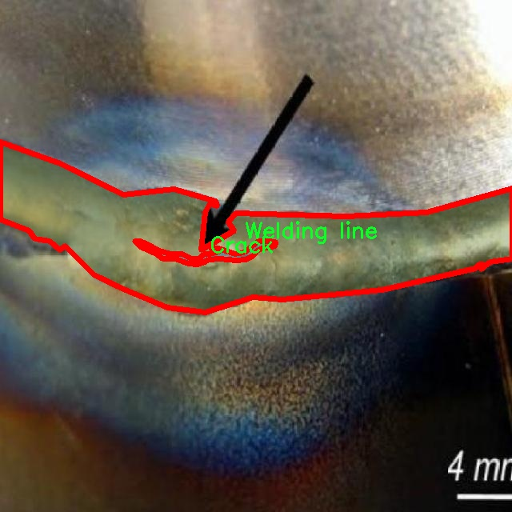
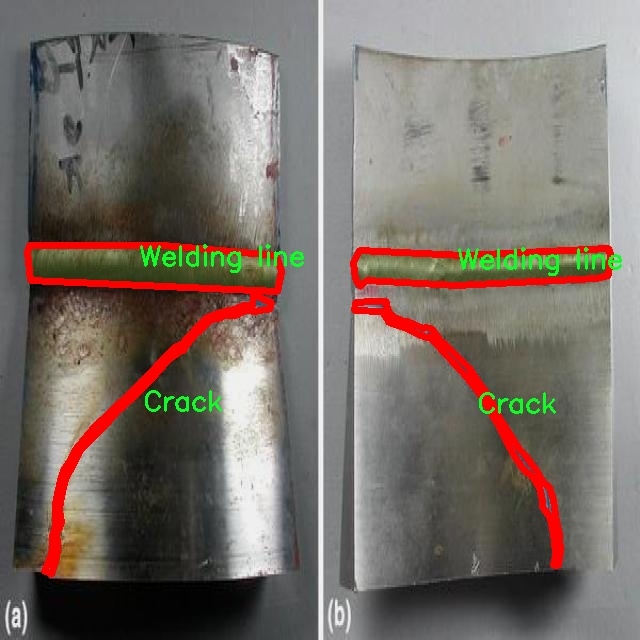
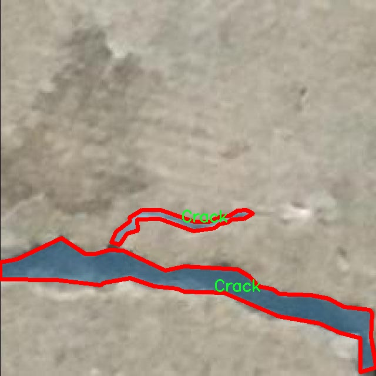

# 焊接缺陷分割系统源码＆数据集分享
 [yolov8-seg-AFPN-P345＆yolov8-seg-ContextGuidedDown等50+全套改进创新点发刊_一键训练教程_Web前端展示]

### 1.研究背景与意义

项目参考[ILSVRC ImageNet Large Scale Visual Recognition Challenge](https://gitee.com/YOLOv8_YOLOv11_Segmentation_Studio/projects)

项目来源[AAAI Global Al lnnovation Contest](https://kdocs.cn/l/cszuIiCKVNis)

研究背景与意义

焊接作为一种广泛应用于制造业的重要连接工艺，其质量直接影响到产品的安全性和可靠性。然而，焊接过程中常常会出现各种缺陷，如裂纹、气孔、飞溅和焊接线等，这些缺陷不仅降低了焊接接头的强度，还可能导致严重的安全隐患。因此，及时、准确地检测和分割焊接缺陷，对于提高焊接质量、降低生产成本以及保障产品安全具有重要的现实意义。

近年来，随着深度学习技术的迅猛发展，计算机视觉领域在物体检测和分割任务中取得了显著进展。YOLO（You Only Look Once）系列模型因其高效的实时检测能力和较高的准确性，逐渐成为焊接缺陷检测的研究热点。特别是YOLOv8的推出，进一步提升了模型在复杂场景下的检测性能。然而，传统YOLOv8模型在处理焊接缺陷分割任务时，仍然面临着一些挑战，如对小目标的检测能力不足、背景复杂情况下的误检率较高等。因此，基于改进YOLOv8的焊接缺陷分割系统的研究显得尤为重要。

本研究将采用DEDe数据集，该数据集包含5600张焊接缺陷图像，涵盖了四类缺陷：裂纹、气孔、飞溅和焊接线。这些数据的多样性和丰富性为模型的训练和评估提供了良好的基础。通过对这些缺陷的实例分割，不仅可以实现对焊接质量的精准评估，还能为后续的焊接工艺改进提供数据支持。此外，针对不同缺陷类型的特征，研究将通过改进YOLOv8的网络结构和训练策略，以提高模型对焊接缺陷的分割精度和鲁棒性。

在实际应用中，焊接缺陷的自动检测与分割系统可以大幅度提高检测效率，降低人工检测的成本与误差。通过引入深度学习技术，尤其是改进后的YOLOv8模型，能够实现对焊接缺陷的实时监测与分析，进而为焊接工艺的优化提供数据支持。这不仅有助于提升焊接质量，减少次品率，还能有效延长设备的使用寿命，降低维护成本。

综上所述，基于改进YOLOv8的焊接缺陷分割系统的研究，不仅具有重要的理论价值，也具有广泛的应用前景。通过深入探讨焊接缺陷的特征及其检测方法，推动焊接技术的智能化发展，将为制造业的数字化转型提供新的思路和解决方案。

### 2.图片演示







##### 注意：由于此博客编辑较早，上面“2.图片演示”和“3.视频演示”展示的系统图片或者视频可能为老版本，新版本在老版本的基础上升级如下：（实际效果以升级的新版本为准）

  （1）适配了YOLOV8的“目标检测”模型和“实例分割”模型，通过加载相应的权重（.pt）文件即可自适应加载模型。

  （2）支持“图片识别”、“视频识别”、“摄像头实时识别”三种识别模式。

  （3）支持“图片识别”、“视频识别”、“摄像头实时识别”三种识别结果保存导出，解决手动导出（容易卡顿出现爆内存）存在的问题，识别完自动保存结果并导出到tempDir中。

  （4）支持Web前端系统中的标题、背景图等自定义修改，后面提供修改教程。

  另外本项目提供训练的数据集和训练教程,暂不提供权重文件（best.pt）,需要您按照教程进行训练后实现图片演示和Web前端界面演示的效果。

### 3.视频演示

[3.1 视频演示](https://www.bilibili.com/video/BV1EcmTYVEZT/)

### 4.数据集信息展示

##### 4.1 本项目数据集详细数据（类别数＆类别名）

nc: 4
names: ['Crack', 'Porosity', 'Spatters', 'Welding line']


##### 4.2 本项目数据集信息介绍

数据集信息展示

在本研究中，我们采用了名为“DEDe”的数据集，以训练和改进YOLOv8-seg焊接缺陷分割系统。该数据集专门设计用于焊接缺陷的检测与分类，涵盖了四种主要的焊接缺陷类型，分别为裂纹（Crack）、气孔（Porosity）、飞溅（Spatters）和焊接线（Welding line）。这些缺陷在焊接过程中常常出现，严重影响焊接质量和结构的安全性，因此对其进行准确的检测和分割显得尤为重要。

“DEDe”数据集的构建经过精心设计，旨在提供多样化且高质量的样本，以确保模型的训练效果。数据集中包含的每一类缺陷都经过严格的标注，确保每个样本的缺陷特征清晰可辨。裂纹作为一种常见的焊接缺陷，通常表现为金属表面或内部的线状缺陷，可能由于焊接过程中的温度变化或材料应力引起。气孔则是焊接过程中气体未能完全逸出而形成的小孔，通常影响焊接接头的强度和密封性。飞溅是焊接过程中熔融金属飞溅而形成的小颗粒，可能导致表面缺陷和污染。而焊接线则是焊接接头的特征线，虽然在某些情况下是正常的，但不当的焊接线可能会影响焊接的整体质量。

在数据集的构建过程中，研究团队采用了多种图像采集技术，以确保数据的多样性和代表性。样本来源于不同的焊接工艺和材料，涵盖了各种实际应用场景。通过这种方式，数据集不仅包含了理想状态下的焊接图像，还包括了在实际生产中可能遇到的各种复杂情况。这种多样性使得模型在训练过程中能够学习到更丰富的特征，从而提高其在实际应用中的鲁棒性和准确性。

为了进一步增强模型的泛化能力，数据集还包含了不同光照条件、角度和背景下的焊接缺陷图像。这种数据增强策略旨在模拟真实环境中的变化，使得训练出的模型能够更好地适应不同的工作条件。此外，数据集的标注采用了专业的标注工具，确保每个缺陷的边界和类别信息都准确无误，为后续的模型训练提供了可靠的基础。

总之，“DEDe”数据集的构建不仅为YOLOv8-seg焊接缺陷分割系统的训练提供了坚实的数据基础，也为焊接缺陷检测领域的研究提供了宝贵的资源。通过对该数据集的深入分析和利用，我们期望能够显著提升焊接缺陷的检测精度和分割效果，为焊接质量控制和结构安全评估提供有力支持。随着研究的深入，我们相信“DEDe”数据集将成为焊接缺陷检测领域的重要参考资料，推动相关技术的进步与发展。











### 5.全套项目环境部署视频教程（零基础手把手教学）

[5.1 环境部署教程链接（零基础手把手教学）](https://www.bilibili.com/video/BV1jG4Ve4E9t/?vd_source=bc9aec86d164b67a7004b996143742dc)


[5.2 安装Python虚拟环境创建和依赖库安装视频教程链接（零基础手把手教学）](https://www.bilibili.com/video/BV1nA4VeYEze/?vd_source=bc9aec86d164b67a7004b996143742dc)

### 6.手把手YOLOV8-seg训练视频教程（零基础小白有手就能学会）

[6.1 手把手YOLOV8-seg训练视频教程（零基础小白有手就能学会）](https://www.bilibili.com/video/BV1cA4VeYETe/?vd_source=bc9aec86d164b67a7004b996143742dc)


按照上面的训练视频教程链接加载项目提供的数据集，运行train.py即可开始训练



     Epoch   gpu_mem       box       obj       cls    labels  img_size
     1/200     0G   0.01576   0.01955  0.007536        22      1280: 100%|██████████| 849/849 [14:42<00:00,  1.04s/it]
               Class     Images     Labels          P          R     mAP@.5 mAP@.5:.95: 100%|██████████| 213/213 [01:14<00:00,  2.87it/s]
                 all       3395      17314      0.994      0.957      0.0957      0.0843

     Epoch   gpu_mem       box       obj       cls    labels  img_size
     2/200     0G   0.01578   0.01923  0.007006        22      1280: 100%|██████████| 849/849 [14:44<00:00,  1.04s/it]
               Class     Images     Labels          P          R     mAP@.5 mAP@.5:.95: 100%|██████████| 213/213 [01:12<00:00,  2.95it/s]
                 all       3395      17314      0.996      0.956      0.0957      0.0845

     Epoch   gpu_mem       box       obj       cls    labels  img_size
     3/200     0G   0.01561    0.0191  0.006895        27      1280: 100%|██████████| 849/849 [10:56<00:00,  1.29it/s]
               Class     Images     Labels          P          R     mAP@.5 mAP@.5:.95: 100%|███████   | 187/213 [00:52<00:00,  4.04it/s]
                 all       3395      17314      0.996      0.957      0.0957      0.0845


### 7.50+种全套YOLOV8-seg创新点代码加载调参视频教程（一键加载写好的改进模型的配置文件）

[7.1 50+种全套YOLOV8-seg创新点代码加载调参视频教程（一键加载写好的改进模型的配置文件）](https://www.bilibili.com/video/BV1Hw4VePEXv/?vd_source=bc9aec86d164b67a7004b996143742dc)

### 8.YOLOV8-seg图像分割算法原理

原始YOLOv8-seg算法原理

YOLOv8-seg算法是2023年由Ultralytics公司推出的YOLO系列的最新版本，代表了目标检测和图像分割领域的一次重要技术进步。作为YOLOv7的继承者，YOLOv8在多个方面进行了深度优化，尤其是在网络结构、特征提取和处理速度等方面，旨在提升目标检测的精度和效率。该算法不仅适用于目标检测，还扩展到图像分割任务，展示了其广泛的应用潜力。

YOLOv8的核心思想是将整个图像作为输入，通过一系列深度卷积神经网络（CNN）层进行特征提取和目标定位。这种方法避免了传统目标检测算法中常用的滑动窗口或区域提议方法，从而显著提高了检测速度和精度。YOLOv8采用了多尺度训练和测试策略，结合特征金字塔网络（FPN），能够有效处理不同尺寸的目标，提高了对小目标的检测能力。

在网络结构方面，YOLOv8引入了C2F模块，替代了YOLOv5中的C3模块。C2F模块通过并行化更多的梯度流分支，增强了特征提取的能力，提升了模型的整体性能。与YOLOv5相比，YOLOv8的Neck部分进行了结构上的简化，直接将Backbone不同阶段输出的特征进行上采样，减少了计算复杂度，并提高了特征融合的效率。这种设计使得YOLOv8在处理高分辨率图像时，能够更好地保留细节信息，提升检测的准确性。

YOLOv8的Head部分是其创新的关键所在。与之前的Coupled-Head结构不同，YOLOv8采用了Decoupled-Head结构，将目标检测和分类任务解耦。这一变化使得模型在进行类别预测和边界框回归时，可以独立优化各自的损失函数，从而提高了模型的训练效率和预测精度。此外，YOLOv8在损失函数的设计上也进行了改进，采用了Distribution Focal Loss（DFL）和CIoU Loss，旨在更好地聚焦于标签附近的目标，提高模型的收敛速度。

YOLOv8还抛弃了传统的Anchor-Based方法，转而采用Anchor-Free的设计理念。这一创新使得YOLOv8在目标检测中不再依赖于预设的锚框，而是将目标检测转化为关键点检测。通过这种方式，YOLOv8能够更灵活地适应不同的数据集和目标形态，减少了计算复杂度，同时提高了模型的泛化能力。这种无锚框的设计理念，使得YOLOv8在处理复杂场景和多样化目标时，表现出更强的适应性和准确性。

在输入处理方面，YOLOv8采用了自适应图像缩放技术，能够根据输入图像的长宽比进行动态调整。这种方法不仅提高了目标检测的速度，还减少了信息冗余，使得模型在不同尺寸的图像上都能保持良好的性能。此外，YOLOv8在训练过程中引入了Mosaic图像增强技术，通过将多张图像拼接成一张训练样本，增强了模型对不同场景和目标的学习能力。这种数据增强方法有效提升了模型的鲁棒性，使其在实际应用中能够更好地应对各种复杂情况。

YOLOv8的性能在多个标准数据集上得到了验证，尤其是在COCO数据集上，其表现出色。与之前的YOLO版本相比，YOLOv8在精度和速度上均有显著提升，能够满足实时检测的需求。这一特性使得YOLOv8在智能监控、自动驾驶、机器人视觉等多个领域展现出广泛的应用前景。

综上所述，YOLOv8-seg算法通过一系列创新和优化，提升了目标检测和图像分割的性能。其深度卷积神经网络结构、解耦的Head设计、无锚框的检测方法以及自适应输入处理等特点，使得YOLOv8在复杂场景下仍能保持高效和准确的检测能力。随着YOLOv8的推广和应用，未来在目标检测和图像分割领域，YOLOv8无疑将成为一个重要的技术基石，为相关研究和应用提供强有力的支持。


### 9.系统功能展示（检测对象为举例，实际内容以本项目数据集为准）

图9.1.系统支持检测结果表格显示

  图9.2.系统支持置信度和IOU阈值手动调节

  图9.3.系统支持自定义加载权重文件best.pt(需要你通过步骤5中训练获得)

  图9.4.系统支持摄像头实时识别

  图9.5.系统支持图片识别

  图9.6.系统支持视频识别

  图9.7.系统支持识别结果文件自动保存

  图9.8.系统支持Excel导出检测结果数据


### 10.50+种全套YOLOV8-seg创新点原理讲解（非科班也可以轻松写刊发刊，V11版本正在科研待更新）

#### 10.1 由于篇幅限制，每个创新点的具体原理讲解就不一一展开，具体见下列网址中的创新点对应子项目的技术原理博客网址【Blog】：


[10.1 50+种全套YOLOV8-seg创新点原理讲解链接](https://gitee.com/qunmasj/good)

#### 10.2 部分改进模块原理讲解(完整的改进原理见上图和技术博客链接)【如果此小节的图加载失败可以通过CSDN或者Github搜索该博客的标题访问原始博客，原始博客图片显示正常】
### YOLOv8模型原理

YOLOv8是YOLO系列最新的模型,具有非常优秀的检测精度和速度。根据网络的深度与特征图的宽度大小, YOLOv8算法分为:YOLOv8-n、YOLOv8一s 、YOLOv8-m 、 YOLOv8-l、和 YOLOv8-x 5个版本。按照网络结构图,YOLOv8可分为: Inpul 、 Backbone , Neck和Head 4部分。


Backbone采用了CSPDarknet 架构，由CBS (标准卷积层)、C2f模块和 SPPF(金字塔池化）组成。通过5次标准卷积层和C2f模块逐步提取图像特征，并在网络末尾添加SPPF模块，将任意大小的输入图像转换成固定大小的特征向量。分别取P3、P4、P5层的特征提取结果，向Head输出80×80、40 × 40、20×20三个尺度的特征层。
C2f模块借鉴了残差网络(ResNet)以及ELAN的思想，其结构分为两个分支，主干部分利用Bottleneckm2%模块逐步加深网络，分支部分保留输入层通道并与主干部分特征进行融合，如图所示。通过标准卷积层提取新的特征层，相比于YOLOv5使用的C3模块，C2f模块可以在卷积层和全连接层之间建立一个平滑的转换，从而实现了参数的共享，提高了模型的效率和泛化能力。
Head采用了PAN-FPN 结构,将 Backbone输入的3个特征层进行多尺度融合，进行自顶向下(FAN)和自底向上 (PAN)的特征传递，对金字塔进行增强，使不同尺寸的特征图都包含强目标语义信息和强目标特征信息，保证了对不同尺寸样本的准确预测。
Detect借鉴了Decoupled-Head 思想，用一个解耦检测头将输入的不同尺寸特征层分成2个分支进行检测。第1个分支在进行3次卷积后使进行回归任务，输出预测框。第2个分支在进行3次卷积后进行分类任务，输出类别的概率。采用Varifocal_Loss2”作为损失函数，其式为:


### Context_Grided_Network(CGNet)简介
参考该博客提出的一种轻量化语义分割模型Context Grided Network(CGNet)，以满足设备的运行需要。

CGNet主要由CG块构建而成，CG块可以学习局部特征和周围环境上下文的联合特征，最后通过引入全局上下文特征进一步改善联合特征的学习。


 
下图给出了在Cityscapes数据集上对现有的一些语义分割模型的测试效果，横轴表示参数量，纵轴表示准确率(mIoU)。可以看出，在参数量较少的情况下，CGNet可以达到一个比较好的准确率。虽与高精度模型相去甚远，但在一些对精度要求不高、对实时性要求比较苛刻的情况下，很有价值。


高精度模型，如DeepLab、DFN、DenseASPP等，动不动就是几十M的参数，很难应用在移动设备上。而上图中红色的模型，相对内存占用较小，但它们的分割精度却不是很高。作者认为主要原因是，这些小网络大多遵循着分类网络的设计思路，并没有考虑语义分割任务更深层次的特点。

空间依赖性和上下文信息对提高分割精度有很大的作用。作者从该角度出发，提出了CG block，并进一步搭建了轻量级语义分割网络CGNet。CG块具有以下特点： 

学习局部特征和上下文特征的联合特征；
通过全局上下文特征改进上述联合特征；
可以贯穿应用在整个网络中，从low level（空间级别）到high level（语义级别）。不像PSPNet、DFN、DenseASPP等，只在编码阶段以后捕捉上下文特征。；
只有3个下采样，相比一般5个下采样的网络，能够更好地保留边缘信息。
CGNet遵循“深而薄”的原则设计，整个网络又51层构成。其中，为了降低计算，大量使用了channel-wise conv.

小型语义分割模型：

需要平衡准确率和系统开销
进化路线：ENet -> ICNet -> ESPNet
这些模型基本都基于分类网络设计，在分割准确率上效果并不是很好
上下文信息模型：

大多数现有模型只考虑解码阶段的上下文信息并且没有利用周围的上下文信息
注意力机制：

CG block使用全局上下文信息计算权重向量，并使用其细化局部特征和周围上下文特征的联合特征

#### Context Guided Block
CG block由4部分组成：


此外，CG block还采用了残差学习。文中提出了局部残差学习（LRL）和全局残差学习（GRL）两种方式。 LRL添加了从输入到联合特征提取器的连接，GRL添加了从输入到全局特征提取器的连接。从直观上来说，GRL比LRL更能促进网络中的信息传递（更像ResNet~~），后面实验部分也进行了测试，的确GRL更能提升分割精度。


CGNet的通用网络结构如下图所示，分为3个stage，第一个stage使用3个卷积层抽取特征，第二和第三个stage堆叠一定数量的CG block，具体个数可以根据情况调整。最后，通过1x1 conv得到分割结果。


下图是用于Cityscapes数据集的CGNet网络细节说明：输入尺寸为3*680*680；stage1连续使用了3个Conv-BN-PReLU组合，首个组合使用了stride=2的卷积，所以得到了1/2分辨率的feature map；stage2和stage3分别使用了多个CG block，且其中使用了不同大小的膨胀卷积核，最终分别得到了1/4和1/8的feature map。

需注意：

stage2&3的输入特征分别由其上一个stage的首个和最后一个block组合给出（参考上图的绿色箭头）；

输入注入机制，图中未体现，实际使用中，作者还将输入图像下采样1/4或1/8，分别给到stage2和stage3的输入中 ，以进一步加强特征传递。

channel-wise conv。为了缩减参数数量，在局部特征提取器和周围上下文特征提取器中使用了channel-wise卷积，可以消除跨通道的计算成本，同时节省内存占用。但是，没有像MobileNet等模型一样，在depth-wise卷积后面接point-wise卷积（1*1 conv），作者解释是，因为CG block需要保持局部特征和周围上下文特征的独立性，而1*1 conv会破坏这种独立性，所以效果欠佳，实验部分也进行了验证。

个人感觉此处应该指的是depth-wise卷积？

官方Git中对该部分的实现如下：


### 11.项目核心源码讲解（再也不用担心看不懂代码逻辑）

#### 11.1 ui.py

以下是代码中最核心的部分，并附上详细的中文注释：

```python
import sys
import subprocess

def run_script(script_path):
    """
    使用当前 Python 环境运行指定的脚本。

    Args:
        script_path (str): 要运行的脚本路径

    Returns:
        None
    """
    # 获取当前 Python 解释器的路径
    python_path = sys.executable

    # 构建运行命令，使用 streamlit 运行指定的脚本
    command = f'"{python_path}" -m streamlit run "{script_path}"'

    # 执行命令，并等待其完成
    result = subprocess.run(command, shell=True)
    
    # 检查命令执行的返回码，如果不为0，表示执行出错
    if result.returncode != 0:
        print("脚本运行出错。")

# 实例化并运行应用
if __name__ == "__main__":
    # 指定要运行的脚本路径
    script_path = "web.py"  # 这里可以替换为实际的脚本路径

    # 调用函数运行指定的脚本
    run_script(script_path)
```

### 代码说明：
1. **导入模块**：
   - `sys`：用于访问与 Python 解释器相关的变量和函数。
   - `subprocess`：用于执行外部命令。

2. **定义 `run_script` 函数**：
   - 接受一个参数 `script_path`，表示要运行的 Python 脚本的路径。
   - 使用 `sys.executable` 获取当前 Python 解释器的路径，以确保使用正确的 Python 环境。
   - 构建一个命令字符串，使用 `streamlit` 模块运行指定的脚本。
   - 使用 `subprocess.run` 执行命令，并等待其完成。
   - 检查命令的返回码，如果返回码不为0，表示脚本运行出错，并打印错误信息。

3. **主程序块**：
   - 当脚本作为主程序运行时，指定要运行的脚本路径（这里为 `web.py`）。
   - 调用 `run_script` 函数，执行指定的脚本。

这个程序文件名为 `ui.py`，其主要功能是通过当前的 Python 环境运行一个指定的脚本。程序首先导入了必要的模块，包括 `sys`、`os` 和 `subprocess`，以及一个自定义的模块 `QtFusion.path` 中的 `abs_path` 函数。

在 `run_script` 函数中，首先定义了一个参数 `script_path`，它是要运行的脚本的路径。函数内部首先获取当前 Python 解释器的路径，这通过 `sys.executable` 实现。接着，构建一个命令字符串，该命令使用 `streamlit` 模块来运行指定的脚本。命令的格式是将 Python 解释器的路径和脚本路径结合起来，形成一个完整的命令。

然后，使用 `subprocess.run` 方法执行这个命令。这个方法会在一个新的 shell 中运行命令，并返回一个结果对象。通过检查 `result.returncode`，可以判断脚本是否成功运行。如果返回码不为零，说明脚本运行出错，程序会输出一条错误信息。

在文件的最后部分，使用 `if __name__ == "__main__":` 语句来确保只有在直接运行该文件时才会执行以下代码。这里指定了要运行的脚本路径，调用 `abs_path` 函数获取 `web.py` 的绝对路径，并最终调用 `run_script` 函数来执行这个脚本。

总体来看，这个程序的目的是为了方便地运行一个名为 `web.py` 的脚本，利用当前的 Python 环境和 `streamlit` 模块来实现。

#### 11.2 ultralytics\nn\extra_modules\__init__.py

以下是代码中最核心的部分，并附上详细的中文注释：

```python
# 导入模块
# 这些模块可能包含构建神经网络所需的不同组件和功能

from .afpn import *  # 导入自适应特征金字塔网络（AFPN）的相关功能
from .attention import *  # 导入注意力机制相关的功能
from .block import *  # 导入网络中使用的基本构建块
from .head import *  # 导入网络的输出头部结构
from .rep_block import *  # 导入重复块，可能用于构建深层网络
from .kernel_warehouse import *  # 导入内核仓库，可能用于存储和管理卷积核
from .dynamic_snake_conv import *  # 导入动态蛇形卷积的相关功能
from .orepa import *  # 导入OREPA（可能是某种特定的网络结构或模块）
from .RFAConv import *  # 导入RFA卷积（可能是某种特定的卷积操作）
```

### 注释说明：
1. **模块导入**：代码中使用了相对导入（以`.`开头），这意味着这些模块是在同一包内的子模块。每个模块可能实现了特定的功能，通常用于构建深度学习模型。
  
2. **功能说明**：
   - `afpn`：自适应特征金字塔网络，通常用于处理多尺度特征，提升目标检测和分割任务的性能。
   - `attention`：实现注意力机制，可以帮助模型关注输入中的重要部分，提升性能。
   - `block`：定义了网络中的基本构建块，可能包括卷积层、激活函数等。
   - `head`：负责模型的输出部分，通常包含分类或回归的逻辑。
   - `rep_block`：可能用于构建重复的网络结构，以便于加深网络。
   - `kernel_warehouse`：用于管理卷积核的模块，可能涉及卷积操作的优化。
   - `dynamic_snake_conv`：实现动态蛇形卷积，可能是一种新型的卷积操作。
   - `orepa`：可能是某种特定的网络结构或优化方法。
   - `RFAConv`：实现了一种特定的卷积操作，可能用于提升模型的表现。

通过这些模块的组合，可以构建出复杂的深度学习模型，适用于各种计算机视觉任务。

这个程序文件是一个Python模块的初始化文件，位于`ultralytics/nn/extra_modules/`目录下。文件名为`__init__.py`，它的主要作用是将该目录标识为一个Python包，并且可以在导入时执行一些初始化操作。

在这个文件中，使用了多个`from ... import *`语句，这意味着它从同一目录下的多个模块中导入所有的公共成员。具体来说，这些模块包括：

- `afpn`: 可能是一个实现特定功能的模块，具体功能需要查看该模块的代码。
- `attention`: 这个模块可能与注意力机制相关，通常在深度学习中用于提升模型对重要特征的关注。
- `block`: 可能定义了一些基本的网络结构或层。
- `head`: 通常在神经网络中指的是输出层，可能与模型的最终输出有关。
- `rep_block`: 可能是某种重复结构的模块，常用于构建深层网络。
- `kernel_warehouse`: 可能涉及到卷积核的管理或存储。
- `dynamic_snake_conv`: 这个名字暗示可能是某种动态卷积操作，具体功能需要查看模块代码。
- `orepa`: 具体功能不明，可能是某种特定的操作或结构。
- `RFAConv`: 可能是某种卷积操作的实现，具体功能需要查看该模块的代码。

通过这样的导入方式，用户在使用`ultralytics.nn.extra_modules`包时，可以直接访问这些模块中的功能，而无需单独导入每一个模块。这种方式使得代码更加简洁，便于使用和维护。

#### 11.3 ultralytics\nn\modules\conv.py

以下是经过简化和注释的核心代码部分，主要包括卷积模块的实现及其相关功能。

```python
import torch
import torch.nn as nn
import math

def autopad(k, p=None, d=1):
    """自动计算填充以保持输出形状与输入相同。"""
    if d > 1:
        k = d * (k - 1) + 1 if isinstance(k, int) else [d * (x - 1) + 1 for x in k]  # 实际的卷积核大小
    if p is None:
        p = k // 2 if isinstance(k, int) else [x // 2 for x in k]  # 自动填充
    return p

class Conv(nn.Module):
    """标准卷积层，包含卷积、批归一化和激活函数。"""
    default_act = nn.SiLU()  # 默认激活函数

    def __init__(self, c1, c2, k=1, s=1, p=None, g=1, d=1, act=True):
        """初始化卷积层及其参数。"""
        super().__init__()
        self.conv = nn.Conv2d(c1, c2, k, s, autopad(k, p, d), groups=g, dilation=d, bias=False)  # 卷积层
        self.bn = nn.BatchNorm2d(c2)  # 批归一化层
        self.act = self.default_act if act is True else act if isinstance(act, nn.Module) else nn.Identity()  # 激活函数

    def forward(self, x):
        """前向传播：应用卷积、批归一化和激活函数。"""
        return self.act(self.bn(self.conv(x)))

class DWConv(Conv):
    """深度可分离卷积层。"""
    def __init__(self, c1, c2, k=1, s=1, d=1, act=True):
        """初始化深度可分离卷积层。"""
        super().__init__(c1, c2, k, s, g=math.gcd(c1, c2), d=d, act=act)  # 使用通道数的最大公约数作为组数

class ConvTranspose(nn.Module):
    """转置卷积层。"""
    default_act = nn.SiLU()  # 默认激活函数

    def __init__(self, c1, c2, k=2, s=2, p=0, bn=True, act=True):
        """初始化转置卷积层及其参数。"""
        super().__init__()
        self.conv_transpose = nn.ConvTranspose2d(c1, c2, k, s, p, bias=not bn)  # 转置卷积层
        self.bn = nn.BatchNorm2d(c2) if bn else nn.Identity()  # 批归一化层
        self.act = self.default_act if act is True else act if isinstance(act, nn.Module) else nn.Identity()  # 激活函数

    def forward(self, x):
        """前向传播：应用转置卷积、批归一化和激活函数。"""
        return self.act(self.bn(self.conv_transpose(x)))

class ChannelAttention(nn.Module):
    """通道注意力模块。"""
    def __init__(self, channels: int) -> None:
        """初始化通道注意力模块。"""
        super().__init__()
        self.pool = nn.AdaptiveAvgPool2d(1)  # 自适应平均池化
        self.fc = nn.Conv2d(channels, channels, 1, 1, 0, bias=True)  # 1x1卷积
        self.act = nn.Sigmoid()  # Sigmoid激活函数

    def forward(self, x: torch.Tensor) -> torch.Tensor:
        """前向传播：计算通道注意力。"""
        return x * self.act(self.fc(self.pool(x)))  # 通过通道注意力调整输入特征

class SpatialAttention(nn.Module):
    """空间注意力模块。"""
    def __init__(self, kernel_size=7):
        """初始化空间注意力模块。"""
        super().__init__()
        assert kernel_size in (3, 7), 'kernel size must be 3 or 7'  # 验证卷积核大小
        padding = 3 if kernel_size == 7 else 1
        self.cv1 = nn.Conv2d(2, 1, kernel_size, padding=padding, bias=False)  # 卷积层
        self.act = nn.Sigmoid()  # Sigmoid激活函数

    def forward(self, x):
        """前向传播：计算空间注意力。"""
        return x * self.act(self.cv1(torch.cat([torch.mean(x, 1, keepdim=True), torch.max(x, 1, keepdim=True)[0]], 1)))  # 通过空间注意力调整输入特征

class CBAM(nn.Module):
    """卷积块注意力模块。"""
    def __init__(self, c1, kernel_size=7):
        """初始化CBAM模块。"""
        super().__init__()
        self.channel_attention = ChannelAttention(c1)  # 通道注意力
        self.spatial_attention = SpatialAttention(kernel_size)  # 空间注意力

    def forward(self, x):
        """前向传播：应用CBAM模块。"""
        return self.spatial_attention(self.channel_attention(x))  # 先计算通道注意力，再计算空间注意力
```

### 代码说明
1. **自动填充函数 `autopad`**: 计算卷积操作中所需的填充，以确保输出的形状与输入相同。
2. **卷积类 `Conv`**: 实现了标准的卷积操作，包含卷积层、批归一化和激活函数。
3. **深度可分离卷积类 `DWConv`**: 继承自 `Conv`，用于实现深度可分离卷积。
4. **转置卷积类 `ConvTranspose`**: 实现转置卷积操作，常用于上采样。
5. **通道注意力模块 `ChannelAttention`**: 通过自适应平均池化和1x1卷积计算通道注意力。
6. **空间注意力模块 `SpatialAttention`**: 通过计算输入特征的平均和最大值来生成空间注意力。
7. **CBAM模块 `CBAM`**: 将通道注意力和空间注意力结合在一起，增强特征表示。

这些模块是构建深度学习模型，尤其是目标检测和图像分割模型的重要组成部分。

这个程序文件是一个用于构建卷积模块的Python代码，主要用于Ultralytics YOLO（You Only Look Once）模型的实现。文件中定义了多个卷积相关的类和函数，利用PyTorch框架来构建深度学习模型。

首先，文件导入了必要的库，包括数学库、NumPy和PyTorch的神经网络模块。接着，定义了一个辅助函数`autopad`，用于根据卷积核的大小、填充和扩张因子自动计算填充量，以确保输出的形状与输入相同。

接下来，定义了多个卷积类。`Conv`类是一个标准的卷积层，包含卷积操作、批归一化和激活函数。构造函数中可以设置输入通道数、输出通道数、卷积核大小、步幅、填充、分组和扩张等参数。`forward`方法定义了前向传播的过程，依次进行卷积、批归一化和激活。

`Conv2`类是一个简化的卷积模块，包含一个额外的1x1卷积层，用于增强特征提取能力。它重写了`forward`方法，使得前向传播时可以将两个卷积的输出相加。

`LightConv`类实现了一种轻量级卷积，使用了深度卷积（Depth-wise Convolution）来减少计算量。`DWConv`类则是实现了深度卷积的标准卷积类，适用于通道数较大的情况。

`DWConvTranspose2d`类是深度转置卷积的实现，`ConvTranspose`类则是转置卷积层，支持批归一化和激活函数。

`Focus`类用于将输入的空间信息聚焦到通道空间中，通过对输入进行下采样并进行卷积来实现。`GhostConv`类实现了Ghost卷积，这是一种通过生成更多特征图来提高模型性能的卷积方法。

`RepConv`类是一个重复卷积模块，支持训练和推理阶段的不同操作，主要用于RT-DETR模型。它可以融合多个卷积层的权重和偏置，以减少模型的计算量。

接下来，定义了几个注意力机制模块，包括`ChannelAttention`和`SpatialAttention`，它们通过对输入特征图进行加权来增强重要特征。`CBAM`类则结合了通道注意力和空间注意力，进一步提升特征的表达能力。

最后，`Concat`类用于在指定维度上连接多个张量，常用于模型的特征融合。

整体来看，这个文件实现了多种卷积和注意力机制模块，为YOLO模型的构建提供了灵活的组件，能够有效地处理图像特征提取和增强。

#### 11.4 train.py

以下是经过简化和注释的核心代码部分：

```python
import os
import torch
import yaml
from ultralytics import YOLO  # 导入YOLO模型库

if __name__ == '__main__':  # 确保该模块被直接运行时才执行以下代码
    # 设置训练参数
    workers = 1  # 数据加载的工作进程数
    batch = 8  # 每个批次的样本数量
    device = "0" if torch.cuda.is_available() else "cpu"  # 检查是否有可用的GPU

    # 获取数据集配置文件的绝对路径
    data_path = abs_path(f'datasets/data/data.yaml', path_type='current')

    # 将路径转换为Unix风格
    unix_style_path = data_path.replace(os.sep, '/')
    # 获取数据集目录路径
    directory_path = os.path.dirname(unix_style_path)

    # 读取YAML文件
    with open(data_path, 'r') as file:
        data = yaml.load(file, Loader=yaml.FullLoader)

    # 修改YAML文件中的路径项
    if 'train' in data and 'val' in data and 'test' in data:
        data['train'] = directory_path + '/train'  # 更新训练集路径
        data['val'] = directory_path + '/val'      # 更新验证集路径
        data['test'] = directory_path + '/test'    # 更新测试集路径

        # 将修改后的数据写回YAML文件
        with open(data_path, 'w') as file:
            yaml.safe_dump(data, file, sort_keys=False)

    # 加载YOLO模型
    model = YOLO(r"C:\codeseg\codenew\50+种YOLOv8算法改进源码大全和调试加载训练教程（非必要）\改进YOLOv8模型配置文件\yolov8-seg-C2f-Faster.yaml").load("./weights/yolov8s-seg.pt")

    # 开始训练模型
    results = model.train(
        data=data_path,  # 指定训练数据的配置文件路径
        device=device,  # 指定使用的设备
        workers=workers,  # 数据加载的工作进程数
        imgsz=640,  # 输入图像的大小
        epochs=100,  # 训练的轮数
        batch=batch,  # 每个批次的样本数量
    )
```

### 代码注释说明：
1. **导入必要的库**：导入`os`、`torch`、`yaml`和YOLO模型库，后者用于目标检测和分割任务。
2. **设置训练参数**：定义数据加载的工作进程数、批次大小和设备（GPU或CPU）。
3. **获取数据集配置文件路径**：使用`abs_path`函数获取数据集配置文件的绝对路径，并将其转换为Unix风格的路径。
4. **读取和修改YAML文件**：读取YAML文件，更新训练、验证和测试集的路径，并将修改后的内容写回文件。
5. **加载YOLO模型**：根据指定的配置文件和权重文件加载YOLO模型。
6. **开始训练模型**：调用`train`方法开始训练，传入数据路径、设备、工作进程数、图像大小、训练轮数和批次大小等参数。

该程序文件 `train.py` 是一个用于训练 YOLO 模型的 Python 脚本。首先，它导入了必要的库，包括 `os`、`torch`、`yaml` 和 `ultralytics` 中的 YOLO 模型，以及用于处理路径的 `QtFusion.path` 和用于绘图的 `matplotlib`。

在 `__main__` 块中，程序首先设置了一些训练参数，包括工作进程数 `workers`、批次大小 `batch` 和设备类型 `device`。设备类型会根据是否有可用的 GPU 来决定，如果有 GPU 则使用 "0"，否则使用 "cpu"。

接下来，程序通过 `abs_path` 函数获取数据集配置文件的绝对路径 `data_path`，该文件是一个 YAML 格式的文件，包含了训练、验证和测试数据的路径。程序将路径中的分隔符统一替换为 Unix 风格的斜杠，并获取其目录路径 `directory_path`。

然后，程序打开 YAML 文件并读取内容，使用 `yaml.load` 函数保持原有顺序。接着，它检查 YAML 文件中是否包含 'train'、'val' 和 'test' 三个项，如果存在，则将这些项的路径修改为相对于目录路径的路径。修改完成后，程序将更新后的数据写回 YAML 文件中。

程序中还提到，不同的模型对设备的要求不同，如果出现错误，可以尝试使用其他模型进行测试。接着，程序加载了一个 YOLO 模型的配置文件，并使用预训练的权重文件进行初始化。

最后，程序调用 `model.train` 方法开始训练模型，传入了数据配置文件路径、设备类型、工作进程数、输入图像大小、训练的 epoch 数和批次大小等参数。训练过程将根据这些参数进行，最终输出训练结果。

#### 11.5 ultralytics\hub\utils.py

以下是代码中最核心的部分，并附上详细的中文注释：

```python
import os
import platform
import random
import sys
import threading
import time
from pathlib import Path
import requests
from ultralytics.utils import (ENVIRONMENT, LOGGER, ONLINE, RANK, SETTINGS, TESTS_RUNNING, TQDM, TryExcept, __version__,
                               colorstr, get_git_origin_url, is_colab, is_git_dir, is_pip_package)
from ultralytics.utils.downloads import GITHUB_ASSETS_NAMES

# 定义用于输出日志的前缀
PREFIX = colorstr('Ultralytics HUB: ')
HELP_MSG = '如果此问题持续存在，请访问 https://github.com/ultralytics/hub/issues 寻求帮助。'
HUB_API_ROOT = os.environ.get('ULTRALYTICS_HUB_API', 'https://api.ultralytics.com')
HUB_WEB_ROOT = os.environ.get('ULTRALYTICS_HUB_WEB', 'https://hub.ultralytics.com')

def smart_request(method, url, retry=3, timeout=30, thread=True, code=-1, verbose=True, progress=False, **kwargs):
    """
    使用 'requests' 库进行 HTTP 请求，支持指数退避重试机制，直到达到指定的超时。

    参数:
        method (str): 请求使用的 HTTP 方法，例如 'post' 或 'get'。
        url (str): 要请求的 URL。
        retry (int, optional): 放弃之前尝试的重试次数，默认为 3。
        timeout (int, optional): 超时秒数，超过后将放弃重试，默认为 30。
        thread (bool, optional): 是否在单独的守护线程中执行请求，默认为 True。
        code (int, optional): 请求的标识符，用于日志记录，默认为 -1。
        verbose (bool, optional): 是否在控制台打印输出，默认为 True。
        progress (bool, optional): 请求期间是否显示进度条，默认为 False。
        **kwargs (dict): 传递给请求函数的其他关键字参数。

    返回:
        (requests.Response): HTTP 响应对象。如果请求在单独线程中执行，则返回 None。
    """
    retry_codes = (408, 500)  # 仅对这些状态码进行重试

    @TryExcept(verbose=verbose)
    def func(func_method, func_url, **func_kwargs):
        """进行带有重试和超时的 HTTP 请求，并可选地跟踪进度。"""
        r = None  # 响应对象
        t0 = time.time()  # 记录初始时间
        for i in range(retry + 1):
            if (time.time() - t0) > timeout:
                break  # 超过超时时间，停止重试
            r = requests_with_progress(func_method, func_url, **func_kwargs)  # 发起请求
            if r.status_code < 300:  # 2xx 范围的返回码被视为成功
                break
            try:
                m = r.json().get('message', '没有 JSON 消息。')
            except AttributeError:
                m = '无法读取 JSON。'
            if i == 0:
                if r.status_code in retry_codes:
                    m += f' 重试 {retry} 次，超时 {timeout} 秒。' if retry else ''
                elif r.status_code == 429:  # 速率限制
                    h = r.headers  # 响应头
                    m = f"达到速率限制 ({h['X-RateLimit-Remaining']}/{h['X-RateLimit-Limit']}). " \
                        f"请在 {h['Retry-After']} 秒后重试。"
                if verbose:
                    LOGGER.warning(f'{PREFIX}{m} {HELP_MSG} ({r.status_code} #{code})')
                if r.status_code not in retry_codes:
                    return r  # 如果不是重试状态码，直接返回响应
            time.sleep(2 ** i)  # 指数退避
        return r

    args = method, url
    kwargs['progress'] = progress
    if thread:
        threading.Thread(target=func, args=args, kwargs=kwargs, daemon=True).start()  # 在新线程中执行请求
    else:
        return func(*args, **kwargs)  # 在当前线程中执行请求

class Events:
    """
    用于收集匿名事件分析的类。当设置中的 sync=True 时启用事件分析，sync=False 时禁用。
    
    属性:
        url (str): 发送匿名事件的 URL。
        rate_limit (float): 发送事件的速率限制（秒）。
        metadata (dict): 包含环境元数据的字典。
        enabled (bool): 根据特定条件启用或禁用事件。
    """

    url = 'https://www.google-analytics.com/mp/collect?measurement_id=G-X8NCJYTQXM&api_secret=QLQrATrNSwGRFRLE-cbHJw'

    def __init__(self):
        """初始化 Events 对象，设置事件、速率限制和元数据的默认值。"""
        self.events = []  # 事件列表
        self.rate_limit = 60.0  # 速率限制（秒）
        self.t = 0.0  # 速率限制计时器（秒）
        self.metadata = {
            'cli': Path(sys.argv[0]).name == 'yolo',
            'install': 'git' if is_git_dir() else 'pip' if is_pip_package() else 'other',
            'python': '.'.join(platform.python_version_tuple()[:2]),  # 例如 3.10
            'version': __version__,
            'env': ENVIRONMENT,
            'session_id': round(random.random() * 1E15),
            'engagement_time_msec': 1000}
        self.enabled = \
            SETTINGS['sync'] and \
            RANK in (-1, 0) and \
            not TESTS_RUNNING and \
            ONLINE and \
            (is_pip_package() or get_git_origin_url() == 'https://github.com/ultralytics/ultralytics.git')

    def __call__(self, cfg):
        """
        尝试将新事件添加到事件列表，并在达到速率限制时发送事件。

        参数:
            cfg (IterableSimpleNamespace): 包含模式和任务信息的配置对象。
        """
        if not self.enabled:
            # 事件禁用，不执行任何操作
            return

        # 尝试添加事件
        if len(self.events) < 25:  # 事件列表限制为 25 个事件（丢弃超出此限制的事件）
            params = {
                **self.metadata, 'task': cfg.task,
                'model': cfg.model if cfg.model in GITHUB_ASSETS_NAMES else 'custom'}
            if cfg.mode == 'export':
                params['format'] = cfg.format
            self.events.append({'name': cfg.mode, 'params': params})

        # 检查速率限制
        t = time.time()
        if (t - self.t) < self.rate_limit:
            # 时间在速率限制内，等待发送
            return

        # 超过速率限制，立即发送
        data = {'client_id': SETTINGS['uuid'], 'events': self.events}  # SHA-256 匿名 UUID 哈希和事件列表

        # 使用 POST 请求发送数据
        smart_request('post', self.url, json=data, retry=0, verbose=False)

        # 重置事件和速率限制计时器
        self.events = []
        self.t = t

# 初始化事件收集器
events = Events()
```

以上代码是一个用于发送匿名事件分析的类 `Events` 和一个带有重试机制的 HTTP 请求函数 `smart_request` 的实现。代码中包含了对环境的检测、请求的重试逻辑以及事件的收集和发送。

这个程序文件是Ultralytics YOLO框架中的一个工具模块，主要用于处理与Ultralytics Hub相关的请求和事件分析。文件中包含了一些重要的导入语句，定义了一些常量和函数，以及一个用于事件分析的类。

首先，文件导入了多个标准库和Ultralytics库中的工具函数。这些导入的模块包括操作系统、平台、随机数生成、线程处理、时间管理等，此外还引入了HTTP请求处理的requests库。

接下来，定义了一些常量，例如HUB_API_ROOT和HUB_WEB_ROOT，这些常量分别用于指定Ultralytics Hub的API和Web根地址。HELP_MSG常量提供了在出现问题时的帮助信息。

文件中定义了多个函数。`request_with_credentials`函数用于在Google Colab环境中进行带有凭证的AJAX请求。它首先检查当前环境是否为Colab，如果不是，则抛出异常。该函数使用JavaScript在Colab中发送POST请求，并返回响应数据。

`requests_with_progress`函数用于执行HTTP请求，并在下载过程中显示进度条。它接受HTTP方法、URL和其他可选参数，如果设置了进度条，则会在下载时显示进度。

`smart_request`函数是一个更复杂的请求处理函数，支持重试机制和超时设置。它会在请求失败时进行指数退避重试，最多重试指定次数。该函数也可以选择在单独的线程中执行请求，以避免阻塞主线程。

接下来，定义了一个名为`Events`的类，用于收集匿名事件分析数据。该类在初始化时设置了一些属性，包括事件的URL、速率限制、元数据等。它还根据特定条件决定是否启用事件收集。

`Events`类的`__call__`方法用于尝试将新事件添加到事件列表中，并在达到速率限制时发送事件。如果事件列表中的事件数量超过25，则会丢弃多余的事件。该方法会检查时间是否超过速率限制，如果超过，则将事件数据发送到指定的URL，并重置事件列表和时间戳。

最后，文件在末尾创建了一个`Events`类的实例，以便在后续的代码中使用。这个模块的设计使得在使用Ultralytics Hub时能够方便地进行HTTP请求和事件分析，增强了用户体验和数据收集能力。

#### 11.6 ultralytics\data\converter.py

以下是经过简化和注释的核心代码部分，主要包括 COCO 数据集的转换函数和相关的辅助函数。

```python
import json
from collections import defaultdict
from pathlib import Path
import numpy as np
from ultralytics.utils import TQDM, LOGGER
from ultralytics.utils.files import increment_path

def coco91_to_coco80_class():
    """
    将 COCO 数据集中的 91 类别 ID 转换为 80 类别 ID。
    返回一个列表，索引表示 80 类别 ID，值为对应的 91 类别 ID。
    """
    return [
        0, 1, 2, 3, 4, 5, 6, 7, 8, 9, 10, None, 11, 12, 13, 14, 15, 16, 17, 18, 19, 20, 21, 22, 23, None, 24, 25, None,
        None, 26, 27, 28, 29, 30, 31, 32, 33, 34, 35, 36, 37, 38, 39, None, 40, 41, 42, 43, 44, 45, 46, 47, 48, 49, 50,
        51, 52, 53, 54, 55, 56, 57, 58, 59, None, 60, None, None, 61, None, 62, 63, 64, 65, 66, 67, 68, 69, 70, 71, 72,
        None, 73, 74, 75, 76, 77, 78, 79, None
    ]

def convert_coco(labels_dir='../coco/annotations/',
                 save_dir='coco_converted/',
                 cls91to80=True):
    """
    将 COCO 数据集的标注转换为 YOLO 格式的标注文件。
    
    参数:
        labels_dir (str): COCO 数据集标注文件的路径。
        save_dir (str): 保存转换后结果的路径。
        cls91to80 (bool): 是否将 91 类别 ID 映射到 80 类别 ID。
    """
    # 创建保存目录
    save_dir = increment_path(save_dir)  # 如果目录已存在，则递增
    for p in save_dir / 'labels', save_dir / 'images':
        p.mkdir(parents=True, exist_ok=True)  # 创建目录

    # 获取 COCO 80 类别映射
    coco80 = coco91_to_coco80_class()

    # 导入 JSON 文件并处理
    for json_file in sorted(Path(labels_dir).resolve().glob('*.json')):
        fn = Path(save_dir) / 'labels' / json_file.stem.replace('instances_', '')  # 文件名
        fn.mkdir(parents=True, exist_ok=True)
        with open(json_file) as f:
            data = json.load(f)

        # 创建图像字典
        images = {f'{x["id"]:d}': x for x in data['images']}
        # 创建图像-标注字典
        imgToAnns = defaultdict(list)
        for ann in data['annotations']:
            imgToAnns[ann['image_id']].append(ann)

        # 写入标注文件
        for img_id, anns in TQDM(imgToAnns.items(), desc=f'Annotations {json_file}'):
            img = images[f'{img_id:d}']
            h, w, f = img['height'], img['width'], img['file_name']

            bboxes = []  # 存储边界框
            for ann in anns:
                if ann['iscrowd']:
                    continue  # 跳过拥挤的标注
                # COCO 的边界框格式为 [左上角 x, 左上角 y, 宽度, 高度]
                box = np.array(ann['bbox'], dtype=np.float64)
                box[:2] += box[2:] / 2  # 将左上角坐标转换为中心坐标
                box[[0, 2]] /= w  # 归一化 x
                box[[1, 3]] /= h  # 归一化 y
                if box[2] <= 0 or box[3] <= 0:  # 如果宽度或高度小于等于 0
                    continue

                cls = coco80[ann['category_id'] - 1] if cls91to80 else ann['category_id'] - 1  # 类别
                box = [cls] + box.tolist()  # 添加类别到边界框
                if box not in bboxes:
                    bboxes.append(box)

            # 写入文件
            with open((fn / f).with_suffix('.txt'), 'a') as file:
                for bbox in bboxes:
                    line = ' '.join(map(str, bbox))  # 将边界框转换为字符串
                    file.write(line + '\n')

    LOGGER.info(f'COCO 数据成功转换。\n结果保存到 {save_dir.resolve()}')
```

### 代码说明：
1. **coco91_to_coco80_class**: 该函数返回一个列表，用于将 COCO 数据集中的 91 类别 ID 映射到 80 类别 ID。
2. **convert_coco**: 该函数将 COCO 数据集的标注文件转换为 YOLO 格式的标注文件。它读取指定目录下的 JSON 文件，提取图像和标注信息，并将其转换为 YOLO 所需的格式，最后将结果保存到指定的目录中。
3. **数据处理**: 在处理每个标注时，首先会跳过拥挤的标注，然后将边界框的左上角坐标转换为中心坐标，并进行归一化处理。最后，将转换后的数据写入到文本文件中。

这个程序文件 `ultralytics\data\converter.py` 是用于将 COCO 数据集的标注格式转换为 YOLO 模型所需的格式的工具。文件中包含了多个函数，每个函数的功能各不相同，主要用于处理数据集的转换和格式化。

首先，文件中定义了两个函数 `coco91_to_coco80_class` 和 `coco80_to_coco91_class`，它们分别用于将 COCO 数据集中的 91 类标识符转换为 80 类标识符，以及反向转换。这两个函数返回一个列表，其中每个索引对应于 COCO 80 类的 ID，值则是对应的 COCO 91 类的 ID。这种转换对于使用不同标注格式的模型训练非常重要。

接下来是 `convert_coco` 函数，它是文件的核心功能之一。该函数接受多个参数，包括标注文件的目录、保存结果的目录、是否使用分割掩码和关键点等。函数首先创建保存结果的目录，并调用 `coco91_to_coco80_class` 函数获取类映射。然后，它遍历指定目录下的所有 JSON 文件，读取每个文件中的图像和标注信息，并将其转换为 YOLO 格式的标注文件。具体来说，函数会对每个图像的标注进行处理，将 COCO 的边界框格式转换为 YOLO 所需的格式，并根据需要处理分割和关键点信息。最终，处理后的标注信息会被写入到指定的文本文件中。

此外，文件中还定义了 `convert_dota_to_yolo_obb` 函数，用于将 DOTA 数据集的标注转换为 YOLO 的有向边界框格式。该函数同样处理图像和标注文件，读取原始标注并将其转换为 YOLO 格式，支持训练和验证阶段的图像。

还有一些辅助函数，例如 `min_index` 和 `merge_multi_segment`，前者用于计算两个二维点数组之间的最短距离索引，后者用于合并多个分割线段，确保它们在视觉上连接在一起。

总的来说，这个程序文件的主要目的是为机器学习模型提供数据预处理功能，确保数据集的标注格式符合模型训练的要求。通过这些转换，用户可以方便地将不同格式的数据集用于 YOLO 模型的训练和评估。

### 12.系统整体结构（节选）

### 整体功能和构架概括

Ultralytics YOLO框架是一个用于目标检测和图像分类的深度学习模型实现。该框架提供了一系列模块和工具，用于模型的训练、推理、数据处理和可视化。整体架构由多个子模块组成，每个模块负责特定的功能，例如模型构建、数据集转换、训练过程管理、可视化工具等。

- **模型构建**：通过定义不同的卷积层和注意力机制，构建YOLO模型的神经网络结构。
- **数据处理**：提供数据集格式转换工具，将常见的数据集格式（如COCO、DOTA）转换为YOLO所需的格式。
- **训练管理**：管理训练过程，包括参数设置、模型保存和加载等。
- **可视化**：提供可视化工具，用于展示训练过程中的指标和结果。
- **事件分析**：收集和分析用户在使用框架时的事件数据，以便于后续改进。

### 文件功能整理表

| 文件路径                                          | 功能描述                                               |
|--------------------------------------------------|--------------------------------------------------------|
| `ultralytics/utils/callbacks/wb.py`             | 实现与Weights & Biases的集成，用于监控训练过程中的指标。 |
| `ui.py`                                          | 提供用户界面功能，允许通过Streamlit运行指定的脚本。      |
| `ultralytics/nn/extra_modules/__init__.py`      | 初始化额外模块，导入卷积、注意力机制等功能模块。         |
| `ultralytics/nn/modules/conv.py`                | 定义卷积层和相关操作，包括标准卷积、深度卷积等。         |
| `train.py`                                       | 负责模型的训练过程，包括数据加载、模型初始化和训练管理。 |
| `ultralytics/hub/utils.py`                       | 提供与Ultralytics Hub的HTTP请求和事件分析功能。         |
| `ultralytics/data/converter.py`                  | 将COCO和DOTA数据集的标注格式转换为YOLO所需的格式。      |
| `ultralytics/nn/extra_modules/rep_block.py`     | 定义重复卷积模块，支持模型的轻量化和高效训练。           |
| `ultralytics/nn/__init__.py`                     | 初始化神经网络模块，整合不同的网络组件。                 |
| `ultralytics/models/yolo/classify/__init__.py`  | 初始化YOLO分类模型模块，提供分类相关的功能。             |
| `ultralytics/nn/extra_modules/RFAConv.py`       | 实现RFA卷积，增强特征提取能力。                          |
| `web.py`                                         | 提供Web界面功能，允许用户通过浏览器与模型交互。          |
| `ultralytics/trackers/utils/gmc.py`             | 实现与目标跟踪相关的功能，可能包括图像处理和分析工具。   |

这个表格总结了每个文件的主要功能，帮助理解Ultralytics YOLO框架的整体结构和各个模块之间的关系。

注意：由于此博客编辑较早，上面“11.项目核心源码讲解（再也不用担心看不懂代码逻辑）”中部分代码可能会优化升级，仅供参考学习，完整“训练源码”、“Web前端界面”和“50+种创新点源码”以“14.完整训练+Web前端界面+50+种创新点源码、数据集获取”的内容为准。

### 13.图片、视频、摄像头图像分割Demo(去除WebUI)代码

在这个博客小节中，我们将讨论如何在不使用WebUI的情况下，实现图像分割模型的使用。本项目代码已经优化整合，方便用户将分割功能嵌入自己的项目中。
核心功能包括图片、视频、摄像头图像的分割，ROI区域的轮廓提取、类别分类、周长计算、面积计算、圆度计算以及颜色提取等。
这些功能提供了良好的二次开发基础。

### 核心代码解读

以下是主要代码片段，我们会为每一块代码进行详细的批注解释：

```python
import random
import cv2
import numpy as np
from PIL import ImageFont, ImageDraw, Image
from hashlib import md5
from model import Web_Detector
from chinese_name_list import Label_list

# 根据名称生成颜色
def generate_color_based_on_name(name):
    ......

# 计算多边形面积
def calculate_polygon_area(points):
    return cv2.contourArea(points.astype(np.float32))

...
# 绘制中文标签
def draw_with_chinese(image, text, position, font_size=20, color=(255, 0, 0)):
    image_pil = Image.fromarray(cv2.cvtColor(image, cv2.COLOR_BGR2RGB))
    draw = ImageDraw.Draw(image_pil)
    font = ImageFont.truetype("simsun.ttc", font_size, encoding="unic")
    draw.text(position, text, font=font, fill=color)
    return cv2.cvtColor(np.array(image_pil), cv2.COLOR_RGB2BGR)

# 动态调整参数
def adjust_parameter(image_size, base_size=1000):
    max_size = max(image_size)
    return max_size / base_size

# 绘制检测结果
def draw_detections(image, info, alpha=0.2):
    name, bbox, conf, cls_id, mask = info['class_name'], info['bbox'], info['score'], info['class_id'], info['mask']
    adjust_param = adjust_parameter(image.shape[:2])
    spacing = int(20 * adjust_param)

    if mask is None:
        x1, y1, x2, y2 = bbox
        aim_frame_area = (x2 - x1) * (y2 - y1)
        cv2.rectangle(image, (x1, y1), (x2, y2), color=(0, 0, 255), thickness=int(3 * adjust_param))
        image = draw_with_chinese(image, name, (x1, y1 - int(30 * adjust_param)), font_size=int(35 * adjust_param))
        y_offset = int(50 * adjust_param)  # 类别名称上方绘制，其下方留出空间
    else:
        mask_points = np.concatenate(mask)
        aim_frame_area = calculate_polygon_area(mask_points)
        mask_color = generate_color_based_on_name(name)
        try:
            overlay = image.copy()
            cv2.fillPoly(overlay, [mask_points.astype(np.int32)], mask_color)
            image = cv2.addWeighted(overlay, 0.3, image, 0.7, 0)
            cv2.drawContours(image, [mask_points.astype(np.int32)], -1, (0, 0, 255), thickness=int(8 * adjust_param))

            # 计算面积、周长、圆度
            area = cv2.contourArea(mask_points.astype(np.int32))
            perimeter = cv2.arcLength(mask_points.astype(np.int32), True)
            ......

            # 计算色彩
            mask = np.zeros(image.shape[:2], dtype=np.uint8)
            cv2.drawContours(mask, [mask_points.astype(np.int32)], -1, 255, -1)
            color_points = cv2.findNonZero(mask)
            ......

            # 绘制类别名称
            x, y = np.min(mask_points, axis=0).astype(int)
            image = draw_with_chinese(image, name, (x, y - int(30 * adjust_param)), font_size=int(35 * adjust_param))
            y_offset = int(50 * adjust_param)

            # 绘制面积、周长、圆度和色彩值
            metrics = [("Area", area), ("Perimeter", perimeter), ("Circularity", circularity), ("Color", color_str)]
            for idx, (metric_name, metric_value) in enumerate(metrics):
                ......

    return image, aim_frame_area

# 处理每帧图像
def process_frame(model, image):
    pre_img = model.preprocess(image)
    pred = model.predict(pre_img)
    det = pred[0] if det is not None and len(det)
    if det:
        det_info = model.postprocess(pred)
        for info in det_info:
            image, _ = draw_detections(image, info)
    return image

if __name__ == "__main__":
    cls_name = Label_list
    model = Web_Detector()
    model.load_model("./weights/yolov8s-seg.pt")

    # 摄像头实时处理
    cap = cv2.VideoCapture(0)
    while cap.isOpened():
        ret, frame = cap.read()
        if not ret:
            break
        ......

    # 图片处理
    image_path = './icon/OIP.jpg'
    image = cv2.imread(image_path)
    if image is not None:
        processed_image = process_frame(model, image)
        ......

    # 视频处理
    video_path = ''  # 输入视频的路径
    cap = cv2.VideoCapture(video_path)
    while cap.isOpened():
        ret, frame = cap.read()
        ......
```


### 14.完整训练+Web前端界面+50+种创新点源码、数据集获取


# [下载链接：https://mbd.pub/o/bread/Zp2XmJlt](https://mbd.pub/o/bread/Zp2XmJlt)